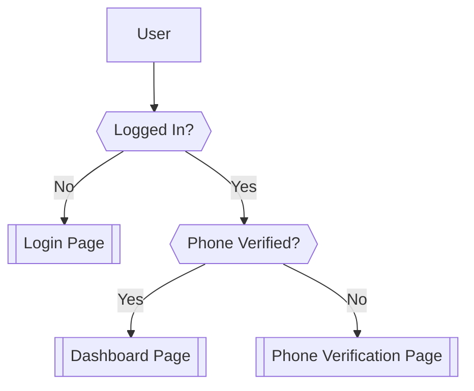

```mermaid
graph TD
%% Entities
User

%% Pages
DashboardPage[[Dashboard Page]]
LoginPage[[Login Page]]
PhoneVerificationPage[[Phone Verification Page]]

%% Checks
LoggedIn{{Logged In?}}
PhoneVerified{{Phone Verified?}}

%% First Flow
User --> LoggedIn

LoggedIn -->|Yes| PhoneVerified
LoggedIn -->|No| LoginPage

PhoneVerified -->|Yes| DashboardPage
PhoneVerified -->|No| PhoneVerificationPage


```
